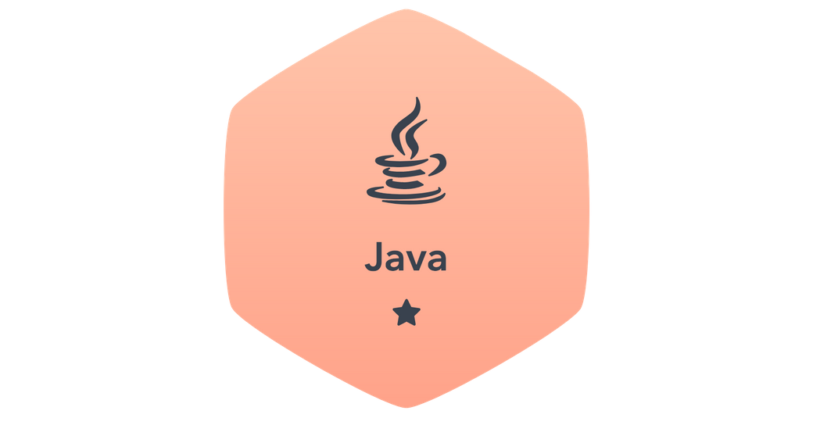

#  

## Solutions Record
## Index
* [Java](##java)

## Java
| Subdomain |	Challenge |	Solution |
|:---------:|:---------:|:--------:|
| Introduction | [Welcome to Java!](https://www.hackerrank.com/challenges/welcome-to-java/) | [WelcomeToJava](Java/WelcomeToJava.java) |
| Introduction | [Java Stdin and Stdout I](https://www.hackerrank.com/challenges/java-stdin-and-stdout-1/) |  [JavaStdinandStdoutI](Java/JavaStdinandStdoutI.java)
| Introduction | [Java If-Else](https://www.hackerrank.com/challenges/java-if-else/) | [JavaIf-Else](Java/JavaIf-Else.java) |
| Introduction | [Java Stdin and Stdout II](https://www.hackerrank.com/challenges/java-stdin-stdout/) | [JavaStdinandStdoutII](Java/JavaStdinandStdoutII.java) |
| Introduction | [Java Output Formatting](https://www.hackerrank.com/challenges/java-output-formatting/) | [JavaOutputFormatting](Java/JavaOutputFormatting.java) |
